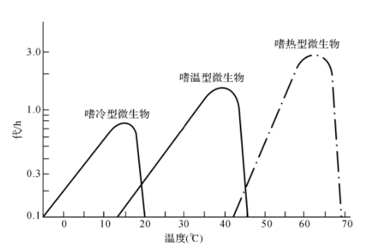
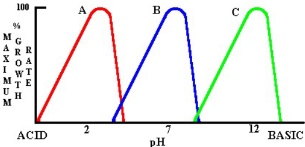

# 第六章 微生物的生长繁殖及其控制

## 概述

一个微生物细胞在合适的外界条件下吸收营养物质进行代谢，若同化作用速度超过了异化作用，细胞就将生长（原生质的总量不断增加）。如果细胞内各组分是按恰当比例增长，达到一定程度后就将发生繁殖，引起个体数目增加。群体内各个体的进一步生长导致群体的生长。

- 生长：生物个体物质有规律地不可逆增加，导致**个体体积扩大**的生物学过程。是逐步发生的量变过程。
- 繁殖：生物个体生长到一定阶段，通过特定方式**产生新的生命个体**，即引起**生命个体数量增加**的生物学过程。是产生新个体的质变过程。

　　高等生物中生长和繁殖可明显区分开，但在低等特别是单细胞生物里，由于细胞小，生长和繁殖是紧密联系、很难划分的过程。

## 细菌的个体生长

**详见课本P125-126**

### 基本概念

- **同形**裂殖：裂殖后生成**大小相等**的子细胞
- 异形裂殖：分裂产生两个大小不等的子细胞

细菌分裂的过程：

- 菌体伸长，核质体分裂
- 形成横隔壁
- 子细胞分离

### 无性繁殖

大部分细菌采用的分裂方式。

过程（二分裂）：

- 染色体DNA的复制与分离

  细菌的双链环状DNA分子在生长时就以双向方式进行复制，**在分裂前完成**。迅速生长的细菌中，可出现两个子细胞的DNA在分裂前就开始复制的情况。

- 细胞壁扩增

  **杆菌**：新合成的肽聚糖在细胞壁多个位点插入，新老细胞壁呈**间隔分布**

  **球菌**：新合成的肽聚糖在**赤道板**附近插入，新老细胞壁能明显分开

  插入肽聚糖前需由自身合成的自溶素（肽聚糖水解酶）打开原来的肽聚糖结构。

- 细菌的分裂与调节

  Z环：由FtsZ蛋白组合而成，形成晚于DNA复制，最终使细胞分裂成两个大小相等的子细胞。
  
  

### 有性繁殖

以E. coli为例：

- F^+^菌和F^-^菌的**性菌毛互相结合**（F^+^菌：有F^+^质粒）
- 性菌毛收缩，两细菌互相靠近
- F^+^菌中的接合质粒**一条链断开**，进入F^-^菌
- DNA复制，生成完整质粒，两个菌都为F^+^

### 放线菌的繁殖

- 主要：无性孢子
  - 分生孢子：横隔分裂/缩缢分裂
  - 孢子囊孢子
- 次要：菌丝片段

## 细菌的群体生长繁殖

- 微生物接种是群体接种，接种后的生长是微生物群体繁殖生长。
- 对细菌群体生长规律的了解是对其进行研究与利用的基础。

### 微生物生长的测定

> 见课本P127~129，基本了解即可

微生物生长：单位时间微生物**数量**或**生物量**的变化

- 个体计数
- 群体重量测定
- 群体生理指标测定

测定微生物生长，可用于

- 评价培养条件、营养物质等对微生物生长的影响
- 评价不同的抗菌物质对微生物抑制/灭杀作用的效果
- 客观反映微生物生长的规律

#### 以数量变化测定

通常用来测定细菌、酵母菌等单细胞微生物的生长情况或样品中所含微生物个体的数量。

1. 培养平板计数法
   - 样品需充分混匀（真实反映浓度）
   - 每支移液管或涂布棒只能接触一个稀释度的菌液
   - 同一稀释度测三次以上取平均值
   - 每个平板上的菌落数目合适，便于准确计数
2. 膜过滤培养法
   - 样品中**菌数很低**时采用
   - 将样品通过膜过滤器，将膜转移到培养基上培养，统计菌落数量
3. [液体稀释法](http://www.cankaowuzhi.com/article/123023)
   - 主要适用于只能进行液体培养的微生物/采用液体鉴别培养基进行直接鉴定并计数的微生物
   - 对未知样品进行十倍稀释，根据估算取3个连续稀释度平行接种多支试管，根据结果和统计学方法计算出微生物数目
4. 显微镜直接计数法
5. 其他
   - 比例计数：将已知颗粒浓度的样品与待测样品混匀后在显微镜下根据二者比例直接推算待测浓度
   - 活菌计数：利用特定染色技术对活菌、死菌分别计数

#### 以生物量为指标

1. 比浊法

   在一定波长下，测定菌悬液的光密度，以光密度（O.D.值）表示菌量。需控制菌浓度在线性范围内。

2. 重量法

   测定**多细胞及丝状真菌生长情况**的有效方法。

   - 以干重、湿重直接衡量微生物群体的生物量
   - 通过样品中蛋白质或核酸含量间接推算微生物群体的生物量

3. 生理指标法

   常用语对微生物的**快速鉴定与检测**。

   - 微生物的呼吸强度、耗氧量、酶活性、生物热等与其群体的规模呈正相关
   - 可借助瓦勃氏呼吸仪、微量量热计等设备测定相应的指标

### 群体生长和生长曲线

#### 无分支单细胞微生物

##### 群体生长特征

- 群体生长以群体中细胞数量的增加表示
- 指数生长
- 包括细菌和酵母菌

##### 分批培养生长曲线

　　细菌接种到定量的液体培养基中，定时取样测定细胞数量，以培养时间为横坐标，菌数为纵坐标作图，得到的一条反映细菌在整个培养期间**菌数变化规律**的曲线。

- 微生物学的“生长”均指群体生长。
- 细菌、酵母菌的生长规律基本相同。

生长曲线的四个时期：按照生长速率常数的不同划分，有迟缓期、对数期、稳定期、衰亡期四个。

- 迟缓期

  特点：**分裂迟缓，代谢活跃**

  - 细胞形态变大或增长，一般是体积最大的时期
  - 细胞内RNA（尤其是rRNA）含量增高，合成代谢活跃，核糖体、酶、ATP的合成加快，易产生诱导酶
  - 对外界不良条件敏感
  - 后期会有少量细胞开始分裂
  - 时间与**菌种的遗传性、菌龄及移种前后环境条件**等因素有关，持续数分钟至数小时不等。

  原因：**调整代谢，适应环境**

  - 可能缺乏分解和催化有关底物的酶
  - 或缺乏充足的中间代谢产物

  <u>缩短</u>迟缓期的常用手段：

  - 通过遗传学方法改变菌种遗传特性
  - 利用对数生长期的细胞作为种子
  - 尽量使接种前后培养基组成接近
  - 适当扩大接种量

- 对数期（指数期）

  现象：细胞数目以指数增加，其对数与时间呈线性关系

  特点：

  - 生长速率常数最大，代时最短
  - 细胞进行**平衡生长**，菌体大小、形态、生理特征等比较一致
  - 代谢最旺盛
  - 对理化因素较敏感

  应用：

  - 菌种健壮，是增殖噬菌体和生产上用作**接种**的最佳菌龄
  - 发酵工业上应尽量<u>延长</u>该期，以达到较高的菌体密度
  - 食品工业上<u>防止</u>有害微生物进入此期（此时期生长快，免疫力下降）
  - 生理代谢及遗传**研究**或进行染色、形态**观察**等的良好材料

- 稳定期（恒定期、最高生长期）

  特点：

  - 细胞的增殖数和死亡数基本相等，生长速率处于动态平衡
  - 培养物中细胞数目达到最高值
  - 细胞分裂速度下降，**开始积累内含物**，产芽孢的细菌**开始产芽孢**
  - **开始合成次生代谢产物**
    - 稳定期后期产物积累达到最高峰，是最佳收获时期

  产生原因：

  - 营养
    - 营养物尤其是生长限制因子的耗尽
    - 营养物的比例失调，如碳氮比等
  - 环境
    - 有害代谢废物的积累（酸、醇、毒素等）
    - 物理化学条件（pH、氧化还原势等）不合适

  意义：

  - 细胞重要的分化调节阶段
  - **储存**糖原等细胞质**内含物**
  - 芽孢杆菌在此阶段形成芽孢或建立感受态等
  - 发酵过程积累代谢产物（抗生素、氨基酸等）的重要阶段，生产上应<u>延长</u>
    - 补充营养物质、调pH、调整温度等
  - 某些放线菌抗生素在此时期大量形成

- 衰亡期

  特点：

  - 细胞死亡数大大超过繁殖新增的数量，群体出现“负增长”
  - 细胞内颗粒更明显，细胞出现多形态、畸形或衰退形，释放次生代谢产物、芽孢等
  - 菌体本身产生的酶、代谢产物使菌体死亡或自溶
  - 长于其他时期，长度与菌种、环境条件有关

  产生原因：生长条件进一步恶化，细胞内分解代谢超过合成代谢，导致菌种死亡。

  死亡的细菌以对数方式增加，但在衰亡后期，由于部分细菌产生抗性，细菌死亡速率将降低，最终仍有活菌存在。

四个时期总结

| 时期     | 迟缓期                   | 对数期             | 稳定期                                     | 衰亡期                                               |
| -------- | ------------------------ | ------------------ | ------------------------------------------ | ---------------------------------------------------- |
| 曲线规律 | 增长缓慢                 | 指数增长           | 动态平衡                                   | 指数负增长                                           |
| 重要特点 | 细胞体积增大             | 平衡生长           | 分裂速度下降                               | 多形态、畸形或衰退形                                 |
| 生理活动 | 合成代谢活跃             | 速率快，代谢旺盛   | 开始产芽孢、次生代谢物                     | 死亡或自溶，释放次级代谢物； 最终只剩少量抗性菌 |
| 形成原因 | 适应环境                 | 营养、条件合适     | 生长限制因子/环境因素                      | 环境进一步恶化                                       |
| 态度     | 缩短                     | （发酵）延长       | 延长                                       | 在此前结束                                           |
| 措施     | 遗传；菌龄；环境；接种量 | 添加营养；改善环境 | 添加营养；改善环境                         |                                                      |
| 应用     |                          | 接种，研究，观察   | 初期收获初级代谢物 大量生产次生代谢物 |                                                      |

##### 二次生长现象

当培养基中同时含有这两类碳源/氮源时，微生物在生长过程会出现**二次生长**现象，即当速效能源消耗、达到平衡后，开始利用迟效能源，重新进入对数期。

> - 速效碳源/氮源：可直接被利用的碳源/氮源，如葡萄糖、$\mathrm{NH^+_4}$等
> - 迟效碳源/氮源：需经过一定适应期后才能获得利用能力，如乳糖、$\mathrm{NO^-_3}$等。详见第四章

##### 常用参数

- 繁殖代数（n）

  细菌生长时为指数增长，设接种时细胞数为x~1~，时间为t~1~，繁殖n代，细胞数为x~2~，则它们的关系为：
  $$
  x_2=x_1\times2^n
  $$
  用对数表示为
  $$
  \log{x_2}=\log{x_1}+n\log{2}
  $$

- 生长速率常数（R）

  繁殖代数与所用时间的比值，即
  $$
  R=\frac{n}{t_2-t_1}=\frac{\log{x_2}-\log{x_1}}{(t_2-t_1)\log{2}}
  $$

- 代时（G）

  由一个细胞分裂为两个细胞的间隔称为世代。一个世代所需的时间为代时，即群体细胞数目扩大一倍所需时间，是生长速率常数的倒数。也称倍增时间。
  $$
  G=\frac{1}{R}=\frac{t_2-t_1}{3.22(\log{x_2}-\log{x_1})}
  $$
  代时能够反映细菌的生长速率。代时短，生长快；代时长，生长慢。在**一定条件**下，每种微生物的代时是**恒定的**，因此它是微生物菌种的一个重要特征。

  影响代时的因素：

  - 微生物种类：一般代时1~3h，有些小于10min，有些长达数小时甚至几天
  - 营养成分：营养丰富的培养基中代时短
  - 营养物浓度：一定范围内，生长速率与营养物浓度成正比
    - 营养物浓度影响生长速率和总生长量。处于较低浓度范围内，可影响生长速率和菌体产量的营养物称为**生长限制因子**。
  - 温度：一定范围内，生长速率与温度正相关

- 迟缓时间：实际达到对数生长期所需时间与理想条件下达到对数生长期所需时间之差。反映了迟缓期给细胞物质的工业化生产造成的损失。

- 总生长量：通过培养获得的微生物总量与原来接种的微生物量之差值。

- 生长产量常数（Y）：也称生长得率（growth yield），指总生长量与消耗基质总量之比。表示微生物对基质利用效率的高低。
  $$
  Y=\frac{菌体干重}{消耗营养物质的浓度}
  $$
  根据产量可确定微生物对营养物质的需要量。

- 比生长率：表示生长速度和生长基质浓度之间的关系，当营养物质浓度很低时，比生长率与营养物质浓度成正比。

##### 微生物生长与代谢产物形成

　　微生物发酵形成产物与生长的过程不总是一致的。

- 初级代谢：给予生物能量和生成中间产物的过程。初级代谢产物往往与微生物细胞形成过程同步，**稳定期**是这些产物的最佳收获时机。
- 次级代谢：与微生物的生存、生长无关。在分批培养中，它们的形成高峰往往在微生物生长稳定期的后期或衰亡期。

#### 丝状微生物

##### 生长特点

- 以菌丝干重为衡量生长的指标
- 孢子接种，震荡培养
- 断裂繁殖

##### 生长曲线

- **生长停滞期**

  原因：

  - 孢子萌发前真正的停滞状态
  - 或生长已开始但还无法测定

- **迅速生长期**

  特点：

  - 菌丝干重迅速增加，其立方根与时间呈直线关系，即$\sqrt[3]{m}\propto{t}$，无对数生长期
  - 菌体呼吸强度达到高峰，有的开始积累代谢产物
  
- **衰退期**

  - 菌丝体干重下降，到一定时期不再变化
  - 大多数**次级产物合成**的时间
  - 大多数细胞出现大的空泡
  - 有些菌丝体发生自溶（与菌种、培养条件有关）

### 同步培养

使群体中细胞处于比较一致的时期（生长发育均处在同一阶段上），即大多数细胞能同时进行生长或分裂的培养方法。

- 同步生长：以同步培养方法使群体细胞能处于同一生长阶段，并同时进行分裂的生长。
- 同步细胞（同步培养物）：通过同步培养方法获得的细胞被称为同步细胞或同步培养物。
- 获得同步培养的方法：
  - 环境条件诱导法：变换温度、光线、培养基等，造成与正常细胞周期不同的周期变化。
  
  - 选择法：选择性过滤或梯度离心。是物理方法，对细胞进行随机选择且不影响细胞代谢。原理是处于同一生长时期的微生物体积、大小相同。
  
    具体步骤：用微孔滤膜（如硝酸纤维微孔滤膜）过滤菌悬液，一部分菌或吸附于滤膜。再将滤膜倒转用新鲜培养液洗脱，会有刚刚分裂下来的细胞被洗掉，收集并培养。（或用蔗糖溶液对细菌梯度离心并分层收集）
  
  - 抑制DNA合成法：加入代谢抑制剂，阻遏DNA复制，再解阻遏，实现同步。
  
    

```mermaid
graph TD;
同步培养法-->选择法;
同步培养法-->调整生理条件法;
同步培养法-->抑制DNA合成法;
选择法-->离心沉降法;
选择法-->分离过滤法;
选择法-->膜过滤法;
调整生理条件法-->温度调整法;
调整生理条件法-->营养条件调整法;
调整生理条件法-->最高稳定期接种;

```

　　同步生长由于细胞个体间的差异不能无限维持，最多能维持2~3个世代。

### 连续培养

> 培养方式：
>
> - 连续培养（continuous culture）：不断补充营养物质、移出营养物。
> - 分批培养/单批发酵（batch culture）：一次投料，一次收获，不补料。
> - 补料分批培养（fed-batch culture）：一段时间补一次料，不连续。

在微生物的整个培养期间，通过一定的方式使微生物能以恒定的比生长速率持续生长的培养方法。

基本原则：

- 不断补充营养物质
- 以同样速率移出营养物

原理：微生物在单批培养方式下生长到对数期后期时，一方面以一定速度加入新鲜培养基并搅拌，另一方面以溢流方式流出培养液，使培养物达到动态平衡，其中的微生物长期保持对数期的平衡生长状态和稳定的生长速率。

> 分批培养/封闭培养：培养基**一次加入**，最后**一次收获**，不补充或更换。

#### 控制连续培养的方法

##### 恒浊连续培养

　　不断调节流速而使细菌培养液浊度保持恒定。

~~~mermaid
graph TD;
测定所培养微生物的光密度值-->自动调节新鲜培养基流入
测定所培养微生物的光密度值-->自动调节培养物流出
自动调节新鲜培养基流入-->使培养物保持某一恒定浊度
自动调节培养物流出-->使培养物保持某一恒定浊度
~~~

- 恒浊培养期的工作精度有光电控制系统的灵敏度决定
- 如果所用培养基中有过量的必需营养物，就可以使菌体维持最高生长速率

##### 恒化连续培养

　　使培养液保持流速不变，且流入流出速率相等。

​		稀释率=流速/容器体积，描述营养物质变化速率。

- 培养物生长速率可以通过限制某种营养成分的供给速度来进行精确的控制
  - 控制稀释率、营养浓度，可以使培养物一直处于某一生长状态（即生长曲线上某一点，可以选对数期or稳定期；生长速率基本恒定）
- 稀释率一般小于最高生长速率，故可使微生物始终在低于其最高生长速率下进行生长繁殖

恒浊器与恒化器的比较

| 装置   | 控制对象                  | 培养基         | 培养基流速 | 生长速率 | 产物                             | 应用范围   |
| ------ | ------------------------- | -------------- | ---------- | -------- | -------------------------------- | ---------- |
| 恒浊器 | 菌体密度 （内控制）   | 无限制生长因子 | 不恒定     | 可达最高 | 大量菌体或与菌体形成相平行的产物 | 生产为主   |
| 恒化器 | 培养基流速 （外控制） | 有限制生长因子 | 恒定       | 低于最高 | 不同生长速率的菌体               | 实验室为主 |

> 连续发酵与单批发酵相比
>
> - 优点：缩短发酵周期；便于自动控制；产物质量均一
> - 菌种易退化；易染杂菌

## 真菌的生长与繁殖

### 丝状真菌的生长与繁殖

overview

~~~mermaid
graph LR;
繁殖方式-->菌丝片段
繁殖方式-->孢子
孢子-->无性孢子:孢囊孢子,分生孢子,节孢子,厚垣孢子
孢子-->有性孢子:卵孢子,接合孢子,子囊孢子,担孢子
~~~

#### 无性繁殖

1. 孢囊孢子

   又叫内生孢子，生于孢子囊内。

   由气生菌丝顶端膨大形成特殊囊状结构——孢子囊。孢子囊在长大过程中形成许多核，每一个核由原生质包裹并产生细胞壁，形成孢囊孢子。带有孢子囊的梗成为孢子囊梗，孢子囊梗深入到孢子囊中的部分叫囊轴或中轴。**孢子囊成熟后释放出孢子。**

   形态：近圆形

   例：根霉、毛霉等。

   

2. 分生孢子

   又称外生孢子，生于细胞外。是大多数子囊菌纲及全部半知菌的无性繁殖方式。

   形成特征：由分生孢子梗顶端细胞特化而成的单个或簇生的孢子。有些霉菌的分生孢子着生在分生孢子垫或分生孢子器等特殊构造上。

   

   形态：极多样。

   例：

   - 曲霉属：分生孢子梗的顶端膨大成球形的顶囊，孢子着生于顶囊的小梗之上。
   - 青霉属：分生孢子着生与帚状的多分支的小梗上。

3. 节孢子

   又称粉孢子。是由菌丝断裂形成的外生孢子。

   形成特征：菌丝生长到一定阶段时，出现许多横膈膜，然后从横膈膜处断裂，产生许多孢子。

   形态：成串的短柱状、桶装或两端钝圆的细胞。

   例：白地霉

   

4. 厚垣孢子

   又称厚壁孢子。是繁殖体也是休眠体，对热、干燥等不良环境抵抗力很强。

   形成特征：菌丝顶端或中间的个别细胞膨大，原生质浓缩变圆，细胞壁**加厚**形成圆形、纺锤形或长方形的孢子。

   形态：圆形、柱形等。

   例：总状毛霉
   
   

#### 有性繁殖

　　经过两个性细胞结合而产生新个体的过程。在霉菌中，**有性繁殖不如无性繁殖普遍**，而是多发生在特定条件下，且自然条件下较多，在一般培养基上不出现。

- 大多数霉菌是单倍体，二倍体仅限于接合子。
- 配子囊：**由菌丝分化**形成特殊的性细胞（器官）
- 不同霉菌有性繁殖方式不同。多数是**配子囊**或由配子囊产生的配子（雌器和雄器）相互交配，形成有性孢子。

##### 有性繁殖的三个阶段

- 质配：两个性细胞的核共存于一个细胞中，形成双核细胞，每个核的染色体数目为单倍。
- 核配：形成二倍体接合子，核的染色体数目变为双倍。
- 减数分裂：形成单倍体有性孢子，为单倍体。

##### 有性繁殖的孢子种类

1. 卵孢子

   由大小不同的配子囊结合后发育而成。

   小型配子囊称雄器，大型的称藏卵器。藏卵器中有一个或数个称为卵球的原生质团，它相当于高等生物的卵。

   生成过程：雄器与藏卵器配合时，雄器中的细胞质和细胞核通过受精管进入藏卵器，并与卵球结合，受精卵球生出外壁，发育成卵孢子。

   分类地位：卵菌纲

   

2. 接合孢子

   由菌丝生出的结构基本相似，形态相同或略有不同的两个配子囊接合而成。

   分类地位：接合菌纲

   形态：厚壁、粗糙、黑壳

   生成过程：两相邻菌丝相遇，各自伸出极短的侧枝（原配子囊）。原配子囊接触后，顶端各自膨大并形成横隔，分隔成两个配子囊细胞，配子囊下的部分称为配子囊柄。其后横隔消失，发生质配、核配，同时外部形成厚壁，即成为接合孢子。

   

   分类（根据产生结合孢子的菌丝来源或亲和力不同）：

   - 同宗配合：菌体自身可孕，可独立进行有性生殖。当同一菌体的两根菌丝甚至同一菌丝的分支相互接触时，便可产生接合孢子。

   - 异宗配合：菌体自身不孕，需借助其他**可亲和菌体的不同交配型**来进行有性生殖。即需要两种不同菌系的菌丝相遇才能形成接合孢子。

     > 不同菌系的菌体在形态、大小上一般无区别，但生理上有区别，常用"+"和"-"表示。如果一种菌系或配子囊为"+"，则凡是能预期接合的就为"-"。

3. 子囊孢子

   在子囊内形成的有性孢子，其形状、大小、颜色因菌种而异。形成子囊孢子是**子囊菌纲**的主要特征。

   分类地位：子囊菌纲

   子囊：两性细胞接触以后形成的囊状结构，有球形、棒形、圆筒形、长方形等，因细胞种类而异。子囊内孢子一般1~8个。

   形成过程：

   - 霉菌不同性别的菌丝，分化成雄器（小）和产囊器（大），两个性器官接触后，雄器的内含物通过受精丝进入产卵器，进行质配。

   - 质配完成后，产囊器生出许多短菌丝（称为产囊丝），产囊丝顶端的细胞是双核的，在顶端细胞内发生核配，成为子囊母细胞。

   - 子囊母细胞再经有丝分裂、减数分裂产生1~8个子囊孢子。

     > 不同子囊菌形成子囊方式不同：最简单的是两个营养细胞结合形成子囊，细胞核分裂成子核，每个子核形成一个子囊孢子。

   子囊果：在子囊和子囊孢子发育过程中，雄器和雌器下面的细胞生出许多菌丝，形成**保护组织**，整个结构成为一子实体。这种有性的子实体成为子囊果，子囊包裹于其中。

   

4. 担孢子

   担子菌所特有，因着生在担子上得名，是经两性细胞核配合后产生的**外生**孢子。

   分类地位：担子菌纲
   
   

有性孢子总结

| 有性孢子名称 | 染色体倍数 | 有性结构及其形成特征                                         | 举例                                                  | 所属分类地位                                                 |
| ------------ | ---------- | ------------------------------------------------------------ | ----------------------------------------------------- | ------------------------------------------------------------ |
| 卵孢子       | 2n         | 由两个大小不同的配子囊结合后发育而成 小配子囊称雄器，大配子囊称藏卵器 | 同丝水霉                                              | 卵菌纲：小霉目                                               |
| 接合孢子     | 2n         | 两个配子囊接合后发育而成，有<u>两种类型</u>： ①异宗配合：两种不同质的菌才能结合 ②同宗配合：同一菌体的菌丝可自身结合 | 葡枝根霉 大毛霉 性殖根霉                    | 接合菌纲：毛霉目                                             |
| 子囊孢子     | n          | 在子囊中形成。子囊的形成有<u>两种方式</u>： ①两个营养细胞直接交配而成，其外面无菌丝包裹 ②从一个特殊的、来自产囊体的被称为产囊丝的结构上产生子囊，多个子囊外面被菌丝包围形成子实体，称为子囊果 | 马氏单囊霉 麦类白粉菌 粗糙脉胞菌 牛粪盘菌 | 子囊菌纲： 内孢霉目 白粉菌目 球壳目 盘菌目 |
| 担孢子       | n          | 在担子中形成。 担子菌以菌丝结合的方式产生双核菌丝，双核菌丝顶端细胞膨大为担子。 担子内两性细胞核核配后经过减数分裂形成四个单倍体的核，担子顶端长出四个小梗并顶端膨大，四个核分别进入小梗的膨大部位，形成四个外生的单倍体担孢子。 |  蘑菇 多孔菌 木耳 银耳            | 层菌纲： 伞菌目 非褶菌目 木耳目 银耳目   |

### 酵母菌的生长与繁殖

　　根据能否进行有性繁殖，可将酵母菌分为：

- 假酵母：只能进行无性繁殖
- 真酵母：既有无性繁殖，又有有性繁殖

> 酵母菌的代表属：酵母菌属（啤酒酵母、葡萄汁酵母），裂殖酵母属，假丝酵母属（热带假丝酵母、解脂假丝酵母、产朊假丝酵母），球拟酵母属，红酵母属，掷孢酵母属

~~~mermaid
graph TD;
酵母菌的繁殖方式-->无性繁殖
酵母菌的繁殖方式-->有性繁殖
无性繁殖-->芽殖:各种酵母都存在
无性繁殖-->裂殖:裂殖酵母属
无性繁殖-->产无性孢子
产无性孢子-->节孢子:地霉属
产无性孢子-->掷孢子:掷孢酵母属
产无性孢子-->厚垣孢子:白假丝酵母属
有性繁殖-->产子囊孢子
~~~

#### 无性繁殖
1. **芽殖**

   酵母无性繁殖的**主要方式**。一个酵母能形成的芽数是有限的，平均为24个。

   出芽方式：多边出芽、两端出芽、三边出芽、单边出芽等。在环境适宜时可出现假菌丝。

   > 假菌丝：一些酵母芽殖后，子细胞不与母细胞立即分离，并且继续出芽，使细胞成串排列，这样的细胞串就叫假菌丝。假菌丝的各细胞间仅以狭小的面积相连，呈藕节状。
   >
   > 真菌丝：霉菌的菌丝。相连细胞间横隔面积与细胞直径一致，呈竹节状。

   芽殖过程：母细胞形成小凸起$\to$核裂$\to$原生质分配$\to$新膜形成$\to$形成新细胞壁

   芽痕：

   - 出芽痕：酵母出芽繁殖时，母细胞壁上出芽并与子细胞分开的位点。
   - 诞生痕：酵母出芽繁殖时，子细胞细胞壁上的位点。
   - 通常有**一个诞生痕和多个出芽痕**。

2. **裂殖**

   以细胞横分裂法繁殖，与细菌类似。进行裂殖的酵母菌种类较少，如八孢裂殖酵母。

3. 产生无性孢子

   - **掷孢子**：是掷孢酵母属等少数酵母菌产生的无性孢子，外形呈肾状。这种孢子是在卵圆形的营养细胞生出的小梗上形成的，成熟后将通过一种特有的喷射机制被射出。
- 有的酵母（如Candida albicans）等可在假菌丝顶端产生**厚垣孢子**。

#### 有性繁殖

**适宜条件下**，二倍体细胞减数分裂形成子囊孢子。

过程：

- 临近的两个性亲和性不同的细胞各自伸出一根管状的原生质凸起，两凸起相互结合、局部融合并形成一个通道
- 经过质配、核配形成接合子（双倍体）
- 接合子进行减数分裂，形成4或8个子核
- 每个子核和周围的细胞质一起，在其表面形成孢子壁后即成为**子囊孢子**，形成子囊孢子的细胞成为**子囊**

　实验室子囊孢子的获得：

- 二倍体酵母细胞在一定条件下才能形成单倍体子囊孢子。
- 用营养充足的培养基和强壮活力旺盛的幼龄细胞（种子连续传代3次）
- 培养时：温度25~30℃，需接触大量空气以促进细胞氧化作用
- 选择适当的生孢子培养基（营养贫瘠），使细胞处于饥饿状态。常用石膏块或醋酸钠琼脂斜面等。

#### 酵母菌的生活史

　**生活史**：上代个体经一系列生长、发育阶段而产生下一代个体的全部过程，成为该生物的**生活史**或**生命周期**。

1. 单双倍体型：营养体可以以单倍体和双倍体形式存在，且都可以进行芽殖。在特定条件进行有性生殖。单、双倍体的两个阶段同等重要，形成世代交替。以啤酒酵母为代表。
2. 单倍体型：营养细胞是单倍体，无性繁殖以裂殖方式进行。双倍体细胞不能独立生活。因为双倍体阶段短，一经生成立即减数分裂。以八孢裂殖酵母为代表。
3. 双倍体型：营养体为双倍体，不断进行芽殖，双倍体营养阶段长。单倍体的子囊孢子在子囊内发生接合，单倍体阶段仅以子囊孢子形式存在，不能独立生活。

| 类型       | 营养体存在形式 | 繁殖方式             | 特点                                         | 代表         |
| ---------- | -------------- | -------------------- | -------------------------------------------- | ------------ |
| 单双倍体型 | 单倍体和双倍体 | 都可以芽殖，有时有性 | 两个阶段同等重要，形成世代交替               | 啤酒酵母     |
| 单倍体型   | 单倍体         | 裂殖                 | 双倍体细胞不能独立生活，一经生成立即减数分裂 | 八孢裂殖酵母 |
| 双倍体型   | 双倍体         | 不断芽殖             | 单倍体阶段仅以子囊孢子形式存在，不能独立生活 | 路德类酵母   |

概念：

> 上面酵母：在发酵过程中浮在液体**上层**，是较**活跃的发酵剂**
>
> 下面酵母：在发酵过程中沉在容器底部，是较缓慢的发酵剂

> 嗜杀酵母：在生长过程中能向外分泌嗜杀毒素（一种毒性蛋白）的酵母菌株。其自身对该毒素有免疫力，但能杀死同族或亲缘酵母。
>
> 中性菌株：既不能杀死别的酵母，也不能被嗜杀酵母杀死的菌株。
>
> 敏感菌株：能被嗜杀酵母杀死的菌株。

## 环境因素对生长的影响及生长的测定

- 各种环境因素对微生物生长繁殖有影响，如温度、pH值、溶解氧、氧化还原电位、水分活度、渗透压等
- 微生物生长繁殖也会影响和改变环境
- 通过控制环境因素利用微生物

### 环境因素的影响
#### 温度的影响

##### 影响机制

- **酶活性**：温度影响酶促反应速率，最终影响细胞合成
- **细胞膜流动性**：温度越高，细胞膜流动性越高，越有利于物质运输。膜流动性最终会影响<u>营养物质的吸收和代谢产物的分泌</u>
- 影响物质的**溶解度**，影响生长

##### 最适生长温度

从整体看，微生物生长的温度范围一般是-10\~100℃，极端下限为-30℃，极端上限为105~300℃

生长温度三基点：最适、最低、最高，其中处在最低和最高生长温度时，微生物不生长；**最适生长温度是使微生物分裂代时最短或生长速率最高**的温度。

不同生理生化过程的最适温度不同，最适生长温度≠发酵速度快。

温度对不同类型微生物生长速度的影响

##### 温度类型

###### 低温型微生物

- 最适生长温度：5~20℃
- 分布：两极、冷泉、深海、冷冻场所、冷藏食品等
- 如假单胞菌中的某些嗜冷菌
- 低温下生长的可能机理：
  - 酶在低温时为最适温度，高温时失活
  - 细胞膜不饱和脂肪酸含量高，低温下也能保持良好流动性，可进行物质传递

###### 中温型微生物

- 最适生长温度：20~40℃
- 又具体分为
  - 室温型：主要为腐生或植物寄生
  - 体温型：主要在人或动物体内寄生
- 大多数微生物属于此类

###### 高温型微生物

- 最适生长温度：50~60℃
- 分布：温泉、堆肥、土壤等
- 高温生长的机理：
  - 酶、蛋白、核糖体等抗热能力较强
  - 核酸热稳定性较高（G-C含量高）
  - 细胞膜中饱和脂肪酸含量高，较高温下能维持正常液晶状态
- 特点：生长速度快，合成大分子迅速，可及时修复高温造成的分子损伤
- 应用优势：减少能源消耗、减少杂菌、缩短发酵周期等

| 温度类型 | 最适生长温度 | 分布                                   | 存活机理                               |
| -------- | ------------ | -------------------------------------- | -------------------------------------- |
| 低温型   | 5~20℃        | 两极、冷泉、深海、冷冻场所、冷藏食品等 | 酶的最适温度低，不饱和脂肪酸含量高     |
| 中温型   | 20~40℃       | 腐生或植物寄生、人或动物体内寄生       | 大多数微生物等                         |
| 高温型   | 50~60℃       | 温泉、堆肥、土壤等                     | 各种物质抗热能力较强，饱和脂肪酸含量高 |

#### 氧气的影响

##### 氧气生长类型

|    类型    |   生长环境   | 呼吸链 | 氢受体 |               含有酶的情况                |                    特点                    | 最适的O~2~体积分数 |
| :--------: | :----------: | :----: | :----: | :---------------------------------------: | :----------------------------------------: | :----------------: |
|  专性好氧  |   必须有氧   |  完整  | 分子氧 |              SOD，过氧化氢酶              |                                            |        ≥20%        |
|   微好氧   | 较低的氧分压 |  完整  | 分子氧 |                  少量SOD                  |                                            |       2~10%        |
| 耐氧厌氧型 |  有氧/无氧   |   无   |   -    |     SOD，过氧化物酶，**无过氧化氢酶**     |            依靠专性发酵获得能量            |        <2%         |
|  兼性厌氧  |  有氧/无氧   |        |        |                                           |           有氧时呼吸，无氧时发酵           |                    |
|  兼性好氧  |  有氧/无氧   |   有   |        |              SOD、过氧化氢酶              | 有氧时呼吸（更有利），无氧时发酵或无氧呼吸 |                    |
|  专性厌氧  |     无氧     |   无   |   -    | 无SOD、细胞色素氧化酶，大多数无过氧化氢酶 |   靠发酵、无氧呼吸、循环光合磷酸化等供能   |         0          |

##### 超氧阴离子的形成与去除

- 超氧阴离子在细胞内可由酶促或非酶促形成
- SOD是自我保护机制
  - E. coli缺失SOD后，会由兼性厌氧转为严格厌氧
  - **氧毒害机制**$\star$：由于缺乏SOD或过氧化氢酶，严格厌氧微生物会被超氧阴离子或过氧化氢（等<u>中间产物</u>，活性高）破坏**膜和重要大分子**，导致死亡（而不是被氧气杀死）。好氧微生物有这些酶。

##### 培养方法

- 好氧微生物：<u>震荡或通气</u>
- 专性厌氧微生物：排出环境中<u>氧气</u>，在培养基添加<u>还原剂</u>，降低培养基的氧化还原电势
- 兼性厌氧/耐氧微生物：<u>深层静止培养</u>

#### pH值的影响

##### 环境pH值对微生物的影响机制

- 影响**膜**表面电荷及**通透性**，进而影响物质吸收能力
- 改变**酶**活、酶促反应速率和代谢**途径**
  - 酵母菌在pH=4.5~5产乙醇，在6.5以上产甘油、酸
- 影响营养物质**离子化**程度，影响**吸收**
- 影响有毒物质**毒性**

pH值对不同类型微生物生长速度的影响

##### 微生物对pH值的要求

###### pH值分段

pH值三基点：最适、最低、最高，当pH值低于最低或超过最高时，微生物生长**受抑制或死亡**

微生物的生长pH值范围很广，从pH小于2到大于8都有微生物能生长，但**绝大多数在pH=5.0~9.0之间**。

> - 嗜碱微生物：硝化细菌、尿素分解菌、多数放线菌等
>
> - 耐碱微生物：许多链霉菌
>
> - 中性微生物：绝大多数细菌，一部分真菌
>
> - 嗜酸微生物：硫杆菌属
>
> - 耐酸微生物：乳酸杆菌、醋酸杆菌[^*]
>
>   [^*]: 嗜酸和耐酸哪个pH更低？查不到

###### 生理过程

生长最适的pH值一般不是发酵产物积累的最适pH值。

- 同一种微生物在不同生长阶段和不同生理生化过程中，对pH值的要求不同。
- 同一种微生物由于环境pH值不同，可能积累不同的代谢产物。

###### 胞内pH值

- 胞内pH值一般接近中性且相当稳定
- 利于维持酶的稳定
  - 胞内酶的最适pH值一般为中性，胞外酶最适pH值则接近环境pH值

##### 微生物对环境pH值的影响

- 升高：蛋白质脱羧生成胺类，NaNO~3~的硝酸根被选择性吸收生成NaOH
- 降低：糖、脂类降解生成有机酸，(NH~4~)~2~SO~4~的铵根被选择性吸收生成H~2~SO~4~

##### 培养过程中调节pH值的措施

|      | 调高                         | 调低                           |
| ---- | ---------------------------- | ------------------------------ |
| 治标 | 加NaOH、Na~2~CO~3~等         | 加H~2~SO~4~、HCl等             |
| 治本 | 加蛋白质、尿素等或加大通气量 | 加糖、乳酸、油脂等或降低通气量 |

#### 氧化还原电位的影响

- 好氧微生物：>+0.1V时可正常生长，+0.3~0.4V为宜
- 厌氧微生物：<+0.1V时正常生长
- 兼性厌氧微生物：>+0.1V时有氧呼吸，<+0.1V时发酵

氧分压影响氧化还原电位：

- 氧分压高时，氧化还原电位高；氧分压低时，氧化还原电位低
- 微生物生长时消耗氧气，使氧化还原电位降低
- 可用硫二醇钠、维生素C、谷胱甘肽、H~2~S、Fe等还原剂控制氧化还原电位

#### 水分活度/渗透压的影响

> 水活度：在相同温度、压力下，体系中溶液水的蒸气压与纯水蒸气压之比。

- 一般$\alpha_w=0.95-0.99$时生长
- $\alpha_w=0.60-0.65$时，大多数微生物停止生长（高渗，质壁分离）
- 少数霉菌在$\alpha_w=0.60-0.70$时仍能生长

一般用0.85%NaCl的等渗液培养

## 微生物生长繁殖的控制

　　控制（有害）微生物的生长速率或消灭不需要的微生物，在实际应用中有重要意义。

- 抑制：生长停止，但不死亡
- 防腐：防止或抑制霉腐生物在食品等物质上的生长
- 化疗：杀死或抑制宿主体内的病原微生物
- 死亡：生长能力不可逆丧失
- 消毒：杀死或灭活病原微生物（营养体细胞）
- **灭菌**：杀死**包括芽孢在内的所有微生物**

理化因子抑菌/杀菌作用的影响因素：

- 理化因子的强度或浓度
- 作用时间的长短
- 微生物的种类
- 微生物的不同生长时期

### 用化学物质控制

> 化学物质抗微生物能力的测定（无法区分杀菌/抑菌）：
>
> - 液体培养法：最低抑制浓度实验
> - 平板培养法：抑菌圈实验

#### 抗微生物剂

一类能够杀死微生物或抑制其生长的化学物质

- 抑菌剂：与核糖体结合，导致生长停止。但结合不紧密，**浓度降低时**将游离出来，微生物生长会恢复。
- 杀菌剂：与细胞的作用靶点紧密结合，浓度低时也不会游离，生长不能恢复。
- 溶菌剂：抑制细胞壁合成或损伤细胞质膜

##### 分类

抗微生物剂按是否具有选择性可分为：

- 选择性：对病原微生物毒性更强
  
  - 抗代谢药物、抗生素$\star$、中草药有效成分等
- 非选择性：对**所有细胞**都有毒性
  - 消毒剂：可杀死微生物，用于<u>非生物材料的灭菌或消毒</u>。
  
    包括HgCl~2~、CuSO~4~、碘液、乙烯氧化物、甲醛剂、臭氧等。
  
  - 防腐剂：能杀死微生物或抑制其生长，<u>对人和动物体表组织无毒性或毒性低</u>，可作为外用抗微生物药物。
  
    包括有机汞、0.1\~1%AgNO~3~、碘液、医用酒精、3%H~2~O~2~等。

##### 防腐剂和消毒剂

- 对一切活细胞都有毒性，不能用于人或动物的体内治疗。
- 广泛用于热敏感或无法进行高温灭菌的物品或场所的灭菌。

杀菌能力比较标准：**石碳酸系数**

- 在**一定时间**被试药剂能杀死全部供试菌的最高稀释度和达到同效的石碳酸的最高稀释度的比率。
- 一般规定处理时间**10分钟**，供试菌定为**伤寒沙门氏菌**。

#### 抗代谢物$\star$

某些化合物在结构上与生物体所必需的代谢物很相似，从而可以和特定的酶结合抑制其功能，干扰代谢的正常进行。

> 如叶酸对抗物（磺胺）、嘌呤对抗物（6-巯基嘌呤）、苯丙氨酸对抗物（对氟苯丙氨酸）、尿嘧啶对抗物（5-氟尿嘧啶）、胸腺嘧啶对抗物（5-溴胸腺嘧啶）等。

##### 磺胺类药物

发现最早，最常见的化学疗剂。抗菌谱广，能治疗多种传染病。

- 作用机理：磺胺是叶酸组成部分对氨基苯甲酸的结构类似物，**竞争性抑制**对氨基苯甲酸与<u>二氢叶酸合成酶</u>的结合，从而阻止细菌的生长。
- 对大多数G^+^菌（肺炎球菌、溶血性链球菌等），某些G^-^菌（痢疾杆菌、脑膜炎球菌、流感杆菌等）以及放线菌有作用。
- 对人体无毒性，因为人缺乏二氢叶酸合成酶。

> 抗菌谱：每种抗生素有抑制特定种类微生物的特性，这一**抑菌范围**成为抗菌谱
>
> - 广谱抗生素：对多种类群的细菌起作用。土霉素、四环素等对G^+^和G^-^菌都起作用。
> - 窄谱抗生素：只对少数几种细菌起作用。如青霉素只作用于G^+^菌。

#### 抗生素$\star$

由某些生物合成或半合成的一类次级代谢产物或衍生物，在很低浓度时就能抑制或影响其他种生物的生命活动。

##### 作用机制

抗叶酸代谢、抑制细菌细胞壁合成、破坏细胞质膜、作用于呼吸链干扰氧化磷酸化、抑制蛋白质和核酸合成等。

抗生素的作用机制

##### 耐药性的产生

抗性菌株的特点：

- **细胞质膜通透性改变**，使抗生素无法进入细胞或进入后被排出
- **药物作用靶点改变**，如一些酶改变后无法结合抗生素
- **合成了修饰抗生素的酶**，使抗生素变为无活性形式
- **抗性菌株发生遗传变异**，导致合成新的多聚体（可能指细胞壁某些成分变化）
- **菌株缺乏抗生素作用的对象**，如不含细胞壁的支原体对青霉素有天然抗性
- **细菌产生了抗药的生化途径**，如一些磺胺抗性菌改为从环境摄取叶酸

避免耐药性出现的措施：

- 第一次使用药物剂量要足
- 避免在一个时期或长期多次使用同种抗生素
- 不同的抗生素（或与其他药物）混合使用
- 改造现有抗生素
- 筛选更有效的抗生素

### 用物理因素控制

#### 温度

温度高于微生物最高生长温度或低于最低生长温度时都会对微生物产生杀灭或抑制作用。原理是**使蛋白质、核酸等重要生物大分子变性、破坏**，以及**破坏细胞膜上类脂成分**，导致微生物死亡。

##### 影响微生物耐热能力的因素：

微生物种类及发育阶段

- **嗜热菌**更耐热
- **有芽孢的菌**比无芽孢的菌更耐热
- **微生物的繁殖结构**比营养结构抗热性强
- **老龄菌**比幼龄菌耐热

环境条件影响

- 培养基**蛋白质含量高**时更耐热
- pH值适宜时不易死亡
- 含水量大时易死亡
- **含菌量高**时，抗热性增强
- 热处理时间长容易死亡

##### 耐热性的几种表示方法

- 热力致死时间：在特定温度及其他条件下，杀死一定数量微生物所需要的时间
- F值：在一定的基质中，温度为121.1℃，加热杀死一定数量微生物所用时间
- D值：利用一定温度进行加热，**活菌数减少一个对数周期（即杀死90%）**所需时间。与微生物种类、生长时期、检测培养基的性质等有关
- Z值：加热致死曲线中，**时间缩短一个对数周期（即缩短90%）**时需升高的温度

当**微生物浓度一致时**，可通过比较热致死时间长短来衡量不同微生物的热敏感性。

##### 高温灭菌

- 高压蒸气灭菌法：温度越高，微生物死亡越快。通常使用121.1℃，20min。
- 煮沸消毒：将待消毒物品煮沸15min，以杀死细菌或其他微生物的营养体或少量芽孢、孢子。若条件允许，可添加1%Na~2~CO~3~或2~5%石碳酸，可得到更好效果。
- 干热灭菌：烘箱内热空气灭菌（160\~170℃，1~2h）或火焰灼烧。
- 间隙灭菌：为防止高压蒸气灭菌破坏某些培养基营养成分，可用流通蒸汽（或蒸煮）反复灭菌几次。这样可杀死营养体和芽孢（芽孢在间隙萌发，下一次灭菌时被杀死），也可保证营养物质不被破坏。
- 巴氏消毒法：对热敏物质使用
  - 低温维持法：63℃，30min
  - 高温瞬时法：72℃，15s
  - 超高温法：135\~150℃，2~6s

> 湿热比干热灭菌好：
>
> - 更易于传递热量
> - 更易破坏蛋白质的氢键等结构

> 湿热对一般营养体和孢子的杀灭条件：
>
> - 多数细菌和真菌的营养细胞：60℃，5~10min
> - 酵母菌和真菌的孢子：>80℃
> - 细菌的芽孢：>121℃，>15min

#### 辐射

##### 电磁辐射

利用电磁辐射产生的电磁波杀死大多数物质上的微生物的一种有效方法。

1. 可见光：光强太强或连续长时间照射可能导致微生物死亡（光氧化作用）

2. 紫外线

- 波长100\~400nm，波长260~280nm的UV杀菌能力最强（核酸、蛋白质的吸收峰）
- 原理
  - 作用于DNA，使其产生胸腺嘧啶二聚体，引起结构变性，阻碍正常碱基配对，导致微生物变异或死亡
  - 使空气中氧气变为臭氧，臭氧释放的原子氧有杀菌作用
- 光复活现象：可见光下，DNA修复酶被激活，修复紫外线造成的损伤
- 影响微生物抵抗力的因素
  - 照射时间、强度
  - 微生物种类及生长阶段：G^+^菌抗性强，多倍体抗性强，孢子和芽孢比营养体细胞抗性强
  - 干燥细胞比湿润细胞抗性强
- 应用：穿透力差，用于物体表面、空气、水的消毒杀菌，也用于诱变育种

3. 微波

   产生热效应，使蛋白质、酶等变性，微生物死亡。特点是加热均匀，热能利用率高，加热时间短。主要应用于食品消毒、灭菌。

4. 超声波

   引起细胞膜损坏，细胞破裂，内含物逸出。杀菌效果与频率、强度、处理时间等多种因素有关。应用于破碎细胞提取胞内物质及杀菌。

##### 电离辐射

X-，γ-（Co-60可释放），β-射线，波长短，能量高，有较强杀伤力。

- 原理：引起水和其他物质电离，产生游离基团，使核酸、蛋白质、酶等发生变化，造成细胞损伤或死亡。
- 特点：**穿透力强**，非专一性，对一切生物细胞成分均有杀伤作用。
- 应用：杀菌或诱变育种

### 过滤除菌法

用滤孔小于细菌直径的筛子或滤膜过滤除菌，但无法除去病毒。

- 实验室常用的过滤器：滤膜过滤器、蔡氏过滤器、玻璃过滤器、瓷土过滤器等
- 过滤介质：醋酸纤维素膜、硝酸纤维素膜、聚丙烯膜、石棉板、烧结陶瓷、烧结玻璃等
- 滤器孔径：常用0.22μm、0.45μm
- 应用：对含酶、血清、微生物和氨基酸等热敏物质除菌

### 水分

环境水分缺乏时，可能引起微生物细胞内蛋白质变性和盐类浓度增高，抑制微生物生长甚至导致死亡。

影响微生物抗干燥能力的因素：

- 温度：相同干燥程度下，温度高时，微生物易死亡
- 干燥速度：干燥速度快，微生物不易死亡，反之则易死亡
- 基质：基质中含糖、淀粉、蛋白质等物质时，不易死亡
- 微生物种类及生长时期：
  - **产荚膜菌**抗性强
  - **小型厚壁**比长型薄壁细胞微生物抗性强
  - 细菌的**芽孢**、真菌的**孢子**比营养细胞抗性强
  - **老龄菌**比幼龄菌抗性强

#### 渗透压的影响

对一般微生物，含盐5\~30%或含糖30~80%高渗条件下会被抑制或杀死。

- 高渗溶液中，细胞失水发生质壁分离，生长受抑制或死亡
- 低渗溶液中，细胞吸水膨胀，可能导致破裂死亡

不同种类溶质形成的渗透压大小不同，**小分子溶液比大分子溶液渗透压大，离子溶液比分子溶液渗透压大，相同含量的渗透压盐>糖>蛋白质**。

- 嗜盐细菌：能在15~30%盐溶液中生长，主要分布在盐湖、死海、海水、盐场、腌渍菜中。
  - 低嗜盐菌：2~5%盐溶液中生长
  - 中嗜盐菌：5~20%盐溶液中生长
  - 极端嗜盐菌：20~30%盐溶液中生长
- 耐盐细菌：10%以下盐溶液中生长
- 耐糖细菌：在60%以下含糖溶液中生长，某些霉菌最高可在80%糖溶液中生长

